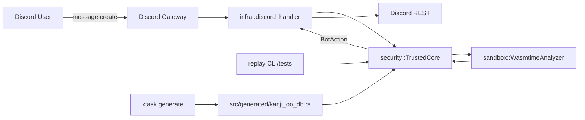

# System Architecture Overview

## 目的

このシステムの全体像を、実装ファイルに対応づけて説明します。

## システム要約

このリポジトリは、Discord メッセージに対して oo 系シーケンスと単漢字読みを解析し、
最終的にリアクションまたはメッセージ送信を決定する Bot です。

主要な設計方針は以下です。

- trusted core と sandboxed analyzer の capability 分離
- Discord API 呼び出しは infra 層のみ
- 解析失敗や外部制約違反時は fail-safe に縮退
- Discord 非依存で replay/fault-injection により再現可能

## コンポーネント

- Entrypoint
  - [src/main.rs](../../src/main.rs)
- Pure logic
  - [src/domain/oo_counter.rs](../../src/domain/oo_counter.rs)
  - [src/domain/reading_normalizer.rs](../../src/domain/reading_normalizer.rs)
  - [src/domain/kanji_matcher.rs](../../src/domain/kanji_matcher.rs)
  - [src/app/analyze_message.rs](../../src/app/analyze_message.rs)
- Runtime protection (trusted core)
  - [src/security/core_governor.rs](../../src/security/core_governor.rs)
  - [src/security/mode.rs](../../src/security/mode.rs)
  - [src/security/duplicate_guard.rs](../../src/security/duplicate_guard.rs)
  - [src/security/rate_limiter.rs](../../src/security/rate_limiter.rs)
  - [src/security/circuit_breaker.rs](../../src/security/circuit_breaker.rs)
  - [src/security/session_budget.rs](../../src/security/session_budget.rs)
  - [src/security/suspicious_input.rs](../../src/security/suspicious_input.rs)
- Sandbox
  - [src/sandbox/abi.rs](../../src/sandbox/abi.rs)
  - [src/sandbox/host.rs](../../src/sandbox/host.rs)
- Discord adapter
  - [src/infra/discord_handler.rs](../../src/infra/discord_handler.rs)
- Replay harness
  - [src/app/replay.rs](../../src/app/replay.rs)
  - [src/bin/replay.rs](../../src/bin/replay.rs)

## システムコンテキスト

## Trust Boundary

- trusted: main process の core/handler、Discord token、HTTP 送信
- untrusted: Discord message content、sandbox guest 実行結果、外部 API 応答

詳細は [architecture/runtime-protection.md](../architecture/runtime-protection.md) と
[security/threat-model.md](../security/threat-model.md) を参照してください。
