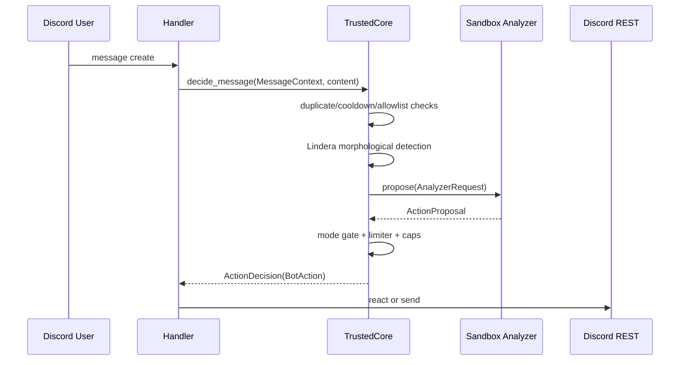

# Data Flow

## 目的

入力メッセージが最終アクションへ変換されるまでのデータフローを、
通常系と異常系に分けて明示します。

## 通常系フロー

## 異常系フロー

- sandbox trap/timeout
  - core は `ActionProposal::Defer` として扱い、送信しない
- suspicious hard input
  - core は suppress reason を `suspicious` として Noop
- repeated 401/403/429
  - circuit breaker が open となり `ObserveOnly` へ遷移
- session budget low
  - `ReactOnly` に遷移し send を react に縮退

## replay/fault-injection フロー

- replay fixture は [src/app/replay.rs](../../src/app/replay.rs) で読み込み
- `run_replay_case_with_core` が runtime overrides を注入
- suppress reason, mode, action を fixture 期待値と照合

関連: [architecture/replay-harness.md](../architecture/replay-harness.md)
